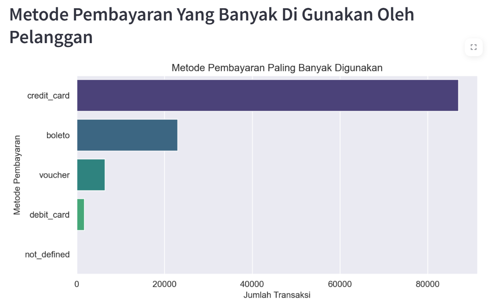
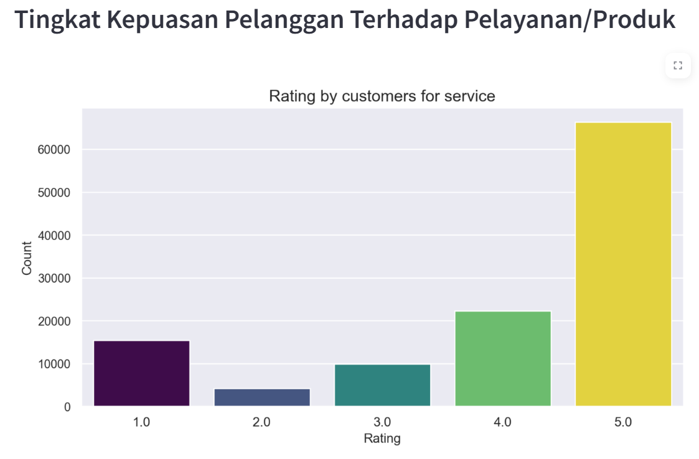

# Project Data Analytics
Repository ini berisi proyek data analytics menggunakkan deployment in Streamlit.

# Deskripsi
Proyek Analisis Data dengan Python menggunakan E-Commerce Publik Dataset. Yang bertujuan untuk menganalisis data pada e-commerce yang menghasilkan wawasan dan informasi yang efektif, berguna dari data yang dianalisis

# Struktur Direktori
- /dashboard : Direktori ini berisi main.py yang digunakan untuk membuat dashboard hasil analisis data.
- /data : Direktori ini berisi data hasil cleaning yang digunakan dalam proyek, dalam format .csv .
- /dataset : Direktori ini berisi data set yang digunakan dalam proyek, dalam format .csv .
- notebook.ipynb : File ini yang digunakan untuk melakukan analisis data.
- requirement.txt : File ini berisi daftar dependensi (library/package python) yang dibutuhkan oleh sebuah proyek.
- url.txt : link dataset yang tersimpan.

# Instalasi
1. Clone repository ini ke komputer lokal mu dengan menggunakan perintah : https://github.com/muazahalwyh/Proyek_Analisis_Data.git
2. Membuat dan mengaktifkan Virtual Environment dengan menggunakan perintah : 
    - python -m venv env 
    - env\Scripts\activate 
3. Instal package yang dibutuhkan untuk analisis data :
    - python -m pip install --upgrade pip
    - pip install numpy pandas seaborn matplotlib streamlit jupyter unidecode
    - jupyter notebook

# Penggunaan 
1. Melakukan Akses dan Kompilasi(Local):
    - cd streamlit
    - streamlit run dashboard.py
2. Deployment
    - https://submission1-h6asrfxm44qvm7gduw2m8l.streamlit.app/

# Dashboard
- 
- 
- 
- 
- 
